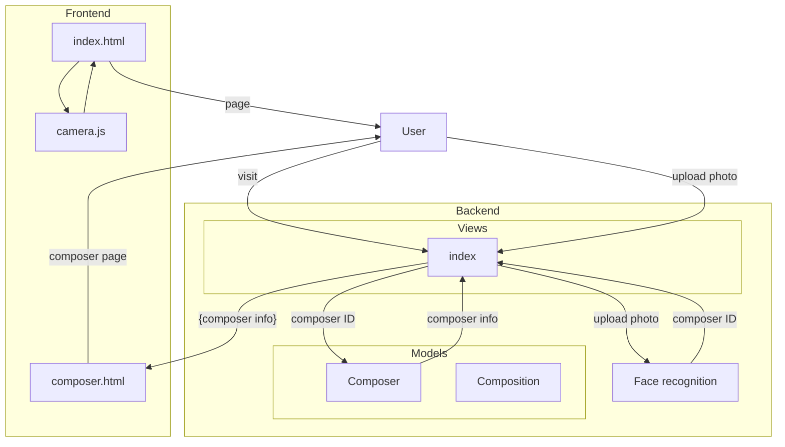

# Plan
## Our application text
Наша команда хочет предложить актуальную и технологичную платформу для *привлечения внимания* к музыкальной классике.
С использованием передовых технологий и обновленных подходов к представлению информации потенциальным слушателям будет предложено пересмотреть не только взгляды на творчество известных композиторов, чьи произведения регулярно исполняются в стенах Московской Филармонии, но и на музыкальное искусство в целом.
  Технологии распознавания образов и лиц привнесут интерактивность в процесс знакомства с биографиями и достижениями авторов классических произведений. Пользователю будет легко получить основную информацию, лишь обратив камеру своего устройства на портрет композитора. Затем приложение определит личность на портрете и предложит ознакомиться с **биографией, творческим путем, значимыми местами из жизни творца и предложит прослушать отрывки произведений или даже посетить ближайшие концерты, на которых будет звучать музыка, написанная этим человеком.**
  Мы считаем, что продолжение музыкальной традиции, соединяющей многие поколения, занимает значимое место в процессе развития культурной среды в городе. Поэтому для сохранения интереса к музыке и ее создателям пользователям могут быть предложены следующие сервисы: 
  Подборки произведений, как индивидуализированные, на основе личных предпочтений, так и на текущих погодных условиях для получения полного спектра эмоций от прослушивания.
  Встроенный музыкальный плеер, который позволит актуализировать представления о музыке "здесь и сейчас". Для неискушенных слушателей будут предложены современные аранжировки великих произведений. Любители же и профессионалы смогут ознакомиться с партитурами и более глубоким анализом творчества композиторов.
## Application main tasks
1. **Facial recognition(main task)**
2. Providing actual data about composer, including(in decreasing priority order):
	* biography
	* music
	* mentions in billboards(Moscow Filarmony exactly)
	* musical scores and deep analysis of crations
3. Ways to extend models by adding new data easily
## Our priorities
   1. Basic readiness ( IT'S WORKING!!)
   2. Presentation
   3. Nice interface
   4. Features
   5. Performance
## Application technology stack
* Django - main backend framework
* OpenCV (probably facial_recorgnition python lib) - buisness logic 
* Bootstrap - good adaptive, animated frontend
## Technical requirements
*That may cause problems*
1. Facial recognition (surprise, huh?)
2. Camera interaction (just file upload, is there better way?)
3. Music player (no ideas yet)
4. *Easy extending?*
## Technical issues that may appear
1. What is the similarity(tolerance) percentage?
2. *More?*
## Divide and conquer
Responsobilities may be divided on:
1. Facial recogintion (fuck, again?)
	* Writing main function 
	* Testing 
2. Backend and buisness logic
	* Models (Database structure)
	* Views (Buisness logic for accessing site path)
	* Deployment and security settings
	* Forms (Do we need to separete it?)
	* Connecting facial - back - front
3. Fontend and design
	* Design many versions - adjustable
	* Main page
	* JS integration(for camera maybe)
	* Other pages?
4. Presentation and speech building
	* Presentation
	* Speech
	* Pictures
	* Demos
5. Data
	* Data collecting??????
	* Or outsourcing

<iframe src="https://mermaidjs.github.io/mermaid-live-editor/#/view/eyJjb2RlIjoiZ2FudHRcbmRhdGVGb3JtYXQgIFlZWVktTU0tREQgSEg6bW1cbnRpdGxlIEZvdW5kYW1lbnRhbCBBcHBsaWNhdGlvblxuXG5zZWN0aW9uIEFydGVtXG5bRGF0YV1EYXRhIGNvbGxlY3QgZm9yIHRlc3QgICAgICAgICA6ZGF0YWNvbCwgMTc6MDAsIDIwbVxuW0Zyb250XU11c2ljIHBsYXllciAgICAgICAgICAgICAgICAgICA6bXVzaWMsIGFmdGVyIGRhdGFjb2wsIDQwbVxuW0ZhY2VzXVRlc3RpbmcgICAgICAgICAgICAgICAgICAgICAgICAgIDpmYWNldGVzdCwgYWZ0ZXIgbXVzaWMsIDIwbVxuXG5zZWN0aW9uIEtvc3R5YVxuW0ZhY2VzXUZhY2UgcmVjb2duaXRpb24gICAgICAgICAgIDpmYWNlcywgMTc6MDAsIDMwbVxuW0ZhY2VzXVRlc3RpbmcgICAgICAgICAgICAgICAgICAgICAgICAgIDpmYWNldGVzdCwgYWZ0ZXIgZmFjZXMsIDQwbVxuXG5zZWN0aW9uIEFsZXhcbltGcm9udF1NYWluIHBhZ2UgICAgICAgICAgICAgICAgICAgICAgOm1wYWdlLCAxNzowMCwgMWhcblxuc2VjdGlvbiBQYXNoYVxuW0JhY2tdTW9kZWxzICAgICAgICAgICAgICAgICAgICAgICAgICAgOm1vZGVsLCAxNzowMCwgMzBtXG5bQmFja11NYWluIHZpZXcgICAgICAgICAgICAgICAgICAgICAgIDp2aWV3LCBhZnRlciBtb2RlbCwgMzBtIFxuW0JhY2tdQ29uZW5jdGluZyBwYXJ0cyAgICAgICAgICAgOmNvbm5lY3QsIGFmdGVyIHZpZXcsIDEwbVxuXG5zZWN0aW9uIEdlbmVyYWxcbltHZW5lcmFsXVVwbG9hZGluZyBkYXRhIGluc2lkZSA6ZmlsbGluZywgYWZ0ZXIgY29ubmVjdCwgMzBtIiwibWVybWFpZCI6eyJ0aGVtZSI6ImRlZmF1bHQifX0" width=1000 height=380></iframe>

## Relations

## Design
### Phones

### Desktops   

